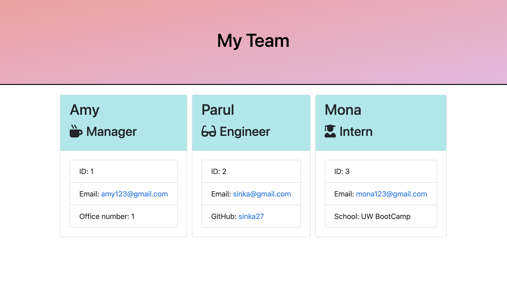

# Team Profile Generator 

## Table of Contents 
  - [Description](#description)
  - [Motivation](#motivation)
  - [Problems Solved](#problems-solved)
  - [Tools and Technologies](#tools-and-technologies)
  - [Links](#links)
  - [Sample Video](#sample-video)
  - [Gif](#gif)
  - [Screenshot of HTML Page](#screenshot-of-html-page)

  ## Description:
  Team Profile Generator is a Node.js command-line application that takes in information about employees on a software engineering team, then generates an HTML webpage that displays summaries for each person.
  

  ## Motivation:
  Application of new learnings

  ## Problems Solved:
  * When prompted for the team members and their information, an HTML file is generated that displays a nicely formatted team roster based on user input.
  * When you click on an email address in the HTML, a default email program opens and populates the 'TO:' field of the email with the entered address.
  * When you click on the GitHub username, then that GitHub profile opens in a new tab.
  * When you start the application, then you are prompted to enter the team manager’s name, employee ID, email address, and office number.
  * Once managers's information is provided, then you are presented with a menu with the option to add an engineer or an intern or to finish building team.
  * On selecting the engineer option, you are prompted to enter the engineer’s name, ID, email, and GitHub username, and you are taken back to the menu.
  * On selecting the intern option, you are prompted to enter the intern’s name, ID, email, and school, and you are taken back to the menu.
  * On selecting the finish option, you exit the application, and the HTML is generated.

  ## Tools and Technologies:
  * Visual Studio Code
  * GitHub
  * JavaScript
  * Node
  * npm inquirer package
  * npm jest package
  * Git
  

  ## Links:
  * Github: https://github.com/sinka27/Team_Profile_Generator

  ## Sample Video:
  The following video demonstrates the application's functionality:
  https://drive.google.com/file/d/1_2U5sMHz7_9o-E1JINzaYuyAWqMY7Dq8/view?usp=sharing

  ## Gif:

  

  ## Screenshot of HTML Page:

  